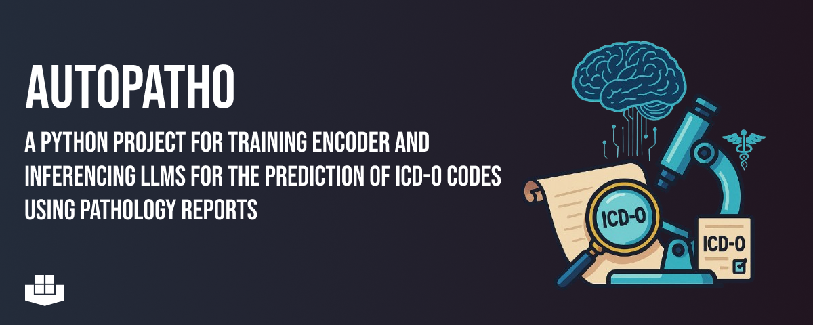

# AutoPathO
[](https://opensource.org/licenses/MIT)
[](https://www.python.org/downloads/release/python-3131/)

<!-- PROJECT LOGO -->


A small Python toolkit to extract ICD-10 and ICD-O codes from pathology reports using prompt-driven LLM inference.

This repository contains utilities to load localization/material code lists, build LLM prompts, call an LLM (either OpenAI-compatible or on-prem), and a convenience script to process a CSV of pathology findings and write predictions back to disk.

**If you use this package, please cite:**

Arzideh K., Hosch R., Turki T., et al. Automated ICD-O-3 Coding of Real-World Pathology Reports Using Self-Hosted Large Language Models. medRxiv (2025). https://doi.org/10.1101/2025.07.23.25332040

## Highlights

- `src/auto_icd_o/extract_codes.py` — orchestration script that scans a dataset, extracts inline ICD labels with regex, and uses the LLM wrapper to generate predictions for missing codes.
- `src/auto_icd_o/llm.py` — lightweight LLM client wrapper and inference helpers. Supports both direct HTTP-to-model endpoints and OpenAI-compatible API usage.
- `src/auto_icd_o/prompts.py` — prompt templates for the three tasks: `icd_10`, `icd_10_wo_locs`, and `icd_o` (morphology).
- `src/auto_icd_o/helpers.py` — utility functions to load localization and material code JSON files (creates them from Excel if missing).

## Contract (short)

- extract_codes.py
  - Inputs: CSV file with a `Befunde` column (pathology findings). Defaults to `data/model_name_results.csv` or falls back to `data/initial_dataset.csv`.
  - Outputs: Updated CSV with columns like `Generated_ICD-10`, `Generated_ICD-O`, and reasoning columns.
  - Error modes: missing data files, missing `Befunde` text — the script guards for columns and will add them if missing.

- llm.py (generate_icd_code)
  - Inputs: `task` (one of `icd_10`, `icd_10_wo_locs`, `icd_o`), `doc` (string), `loc_codes` (list/dict of localization codes), DataFrame, row index, and path to CSV.
  - Output: Writes predicted codes and reasoning into the provided DataFrame and periodically saves the CSV.
  - Error modes: network/API timeouts (with exponential backoff), API compatibility differences.

## Installation (Poetry)

This project uses Poetry for dependency and package management. From the project root (where `pyproject.toml` is):

```bash
# install dependencies and create the virtualenv
poetry install

# you may need to install pytorch manually using pip
pip install torch

# activate a shell inside the poetry-managed venv (optional)
poetry shell

# or run commands via `poetry run` without activating the shell
poetry run python -m auto_icd_o.extract_codes
```

The code expects some data files in `data/` (see Data section). It also uses `python-dotenv` to load environment variables from a `.env` file.

## Configuration / Environment

- The project calls `load_dotenv()` in multiple modules. Provide a `.env` with your model/API configuration.
- `src/auto_icd_o/llm.py` contains a client wrapper using `AsyncOpenAI`. The file currently constructs a `client` with placeholder `base_url` and `api_key`. You should set your values via environment variables or edit `llm.py` to read them from env vars. Typical variables you may set:

```bash
# example .env entries (adapt to your deployment)
OPENAI_API_KEY=sk-...
MODEL_BASE_URL=https://your-model-host/v1
MODEL_NAME=meta-llama/Llama-3.3-70B-Instruct
```

Note: If you use an OpenAI-compatible endpoint, set `use_openai_api=True` in calls to `generate_icd_code` (this toggles the client path).

## Data

- `data/localizations.json` and `data/materials.json` are expected. If not present, `helpers.load_localization_codes()` and `helpers.load_material_codes()` will attempt to read Excel files in `data/` and write JSON versions.
- Default dataset paths used by the script:
  - `data/initial_dataset.csv` — fallback input
  - `data/model_name_results.csv` — primary results file (if exists, it's used)

## Usage

Run the main extraction script (from project root) using Poetry:

```bash
poetry run python -m auto_icd_o.extract_codes
```

What the script does:
- Adds required result columns to the CSV if they don't already exist.
- For each row, extracts inline ICD-10 / ICD-O codes with regex. If a code is present, it sets the GT (ground-truth) column.
- For rows missing generated predictions, it builds a prompt (via `prompts.return_prompt`) and calls `generate_icd_code` (which in turn calls the configured LLM client).
- Results and reasoning are periodically saved to the CSV every 100 processed rows.

Programmatic usage (call `generate_icd_code` from Python):

```python
from auto_icd_o.llm import generate_icd_code
# generate_icd_code is async; example:
import asyncio
asyncio.run(generate_icd_code('icd_10', doc, loc_codes, cases_df, index, 'data/results.csv', use_openai_api=False))
```

Tip: Run scripts with Poetry so they execute in the managed virtual environment (see Installation). Adjust `model_name` or the client configuration in `llm.py` to use a different model or endpoint.

## Training (overview)

The `train/` folder contains utilities and scripts to prepare data, train multi-label classifiers and run inference with saved models. Important scripts:

- `train/prepare_dataset.py` — simple preprocessing to remove inline ICD codes from reports and create a cleaned dataset (`data/patho_icdo_dataset.csv`).
- `train/training_cv.py` — 10-fold cross-validation training harness using Hugging Face `Trainer`. Key points:
  - Supports training for `GT_ICD-10` or `GT_ICD-O` depending on `TARGET_COLUMN`.
  - Uses `EuroBERT/EuroBERT-610m` (configurable) as the base model and a `MultiLabelBinarizer` for multi-label targets.
  - Uses `GroupKFold`/`GroupShuffleSplit` to keep grouped samples together (column `pid` used for grouping).
  - Saves pid-fold models to `./models/` and logs metrics to Weights & Biases.
- `train/inference.py` — load a trained model directory and run batched evaluation on a test split, saving per-sample predictions to `results/`.
- `train/evaluate_cv_models.py` — evaluate all CV fold models on the holdout test set, compute per-fold metrics, prefix-level (3-character) metrics, and aggregate statistics including 95% confidence intervals. Produces summary files in `./evaluation_results/` and caches per-fold predictions in `./cached_data/`.

Run training or evaluation scripts with Poetry, for example:

```bash
# Prepare the dataset
poetry run python -m auto_icd_o.train.prepare_dataset

# Train (runs the CV script; ensure data and W&B are configured)
poetry run python -m auto_icd_o.train.training_cv

# Run inference with a saved model
poetry run python -m auto_icd_o.train.inference

# Evaluate CV models and produce aggregated statistics
poetry run python -m auto_icd_o.train.evaluate_cv_models
```

## Prompts

Prompts are defined in `src/auto_icd_o/prompts.py` and follow these patterns:
- `icd_10` — returns a prompt that includes a list of allowed localization codes and requests only the code as an answer.
- `icd_10_wo_locs` — same but without the explicit localization list.
- `icd_o` — asks for a 5-digit morphology code and includes guidance about the trailing behavior digit (e.g., `/3` for malignant).

If you want to adapt the prompts to a different language or different instruction style, update `return_prompt` accordingly.

## Development notes

- Concurrency and rate-limiting: `llm.py` uses an `asyncio.Semaphore(20)` to limit concurrent calls. Tune this depending on your deployment or API quotas.
- Retries: The LLM wrapper retries on timeouts with exponential backoff.

Additional development notes for training/evaluation:

- The training scripts depend on `transformers`, `torch`, `scikit-learn`, `pandas`, and `wandb` for logging. If you don't use W&B, remove or disable `wandb` calls in `training_cv.py`.
- Cross-validation training saves models into `./models/` with a fold-specific subdirectory. The evaluation scripts expect a certain set of checkpoint files (config, model weights, tokenizer, and `multilabelbinarizer.pkl`).
- Evaluation scripts cache dataset splits and per-fold predictions under `./cached_data/` to speed up repeated runs.

## License
This project is licenced under the [MIT Licence](LICENSE).

## Project status
The project is in active development.
